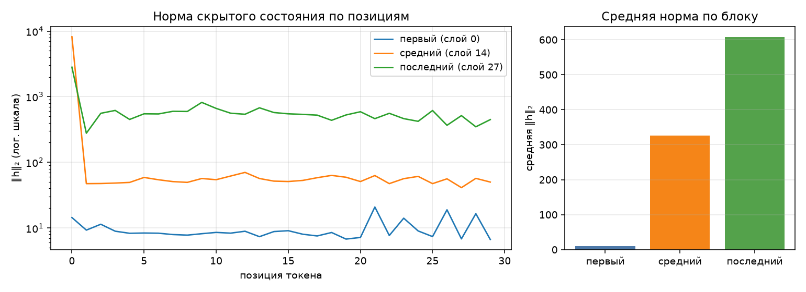

# Анатомия Qwen3-0.6B

Сгенерировано `make inspect`. dtype `bfloat16`, device `cpu`.

## 1. Конфигурация

| Параметр | Значение |
|---|--:|
| слоёв | 28 |
| hidden_size | 1024 |
| intermediate_size | 3072 |
| голов запроса | 16 |
| KV-голов (GQA) | 8 |
| head_dim | 128 |
| словарь | 151 936 |
| tie_word_embeddings | True |

GQA: 16 голов запроса на 8 KV-головы — KV-cache вдвое меньше, чем при обычном multi-head.

## 2. Условия замера

| Условие | Значение |
|---|---|
| платформа | Windows-11-10.0.26200-SP0 (Windows 11, AMD64) |
| устройство | `cpu` |
| dtype | `bfloat16` |
| seq_len × batch | 4 × 1 |
| прогонов на режим | 1 |
| память измерена | `peak_wset` |
| RSS измерена | `peak_wset` |
| python | 3.12.5 |
| torch | 2.14.0+cpu |
| transformers | 4.57.6 |
| peft | 0.20.0 |

На CPU выбрана короткая последовательность seq_len=4: этого достаточно для
сравнения режимов, а полный прогон проверки занимает минуты вместо десятков минут.

Цифры ниже верны только для этих условий. Замер памяти без указания
устройства, dtype, длины последовательности и метрики не воспроизводится
и не сравнивается — поэтому источник метрики стоит отдельной строкой.
Сверьте, что в этой строке названа метрика, уместная для вашего
устройства, и что полученные числа с ней согласуются.

## 3. Параметры по типам модулей

| Группа | Модулей | Shape | Параметров | Доля | Разделяет тензор |
|---|--:|---|--:|--:|--:|
| `embed` | 1 | 151936×1024 | 155 582 464 | 26.10% | — |
| `q_proj` | 28 | 2048×1024 | 58 720 256 | 9.85% | — |
| `k_proj` | 28 | 1024×1024 | 29 360 128 | 4.93% | — |
| `v_proj` | 28 | 1024×1024 | 29 360 128 | 4.93% | — |
| `o_proj` | 28 | 1024×2048 | 58 720 256 | 9.85% | — |
| `gate_proj` | 28 | 3072×1024 | 88 080 384 | 14.78% | — |
| `up_proj` | 28 | 3072×1024 | 88 080 384 | 14.78% | — |
| `down_proj` | 28 | 1024×3072 | 88 080 384 | 14.78% | — |
| `norm` | 113 | 128, 1024 | 65 536 | 0.01% | — |
| `lm_head` | 1 | 151936×1024 | 0 | 0.00% | 155 582 464 |
| **итого** | | | **596 049 920** | 100% | |

Контроль: `sum(p.numel() for p in model.parameters())` = 596 049 920 — сходится с суммой по таблице.

Обратите внимание на строку `lm_head` и на значение `tie_word_embeddings`
в конфигурации: они связаны, и от этой связи зависит итог таблицы.

## 4. Нормы активаций (forward-hooks)

Промпт: «Объясни, что такое MLOps, в трёх предложениях.», 30 токенов после chat template.

| Блок | Индекс | Средняя ‖h‖₂ | Максимум |
|---|--:|--:|--:|
| первый | 0 | 9.7 | 20.9 |
| средний | 14 | 325.5 | 8189.7 |
| последний | 27 | 607.1 | 2815.4 |

Норма растёт от блока к блоку — прямое следствие residual-связей: блок
добавляет к потоку, а не заменяет его. Максимум на порядок-два выше среднего,
и сидит он на первой позиции: это attention sink, массивная активация,
в которую модель складывает «внимание ни к чему». Поэтому шкала на графике
логарифмическая — в линейной один этот выброс придавил бы всё остальное.

Прогон с хуками должен быть повторяемым: второй вызов в том же процессе
обязан дать те же числа и не оставить следов на модулях. В этом прогоне
число зарегистрированных хуков до/после: 0 / 0.

## 5. Сколько параметров добавляет LoRA

| Конфиг | Целевых модулей | Своя формула | peft | Совпало | % от базовой |
|---|--:|--:|--:|:-:|--:|
| r=8, q_proj+v_proj | 2 типов | 1 146 880 | 1 146 880 | да | 0.192% |
| r=16, все линейные | 7 типов | 10 092 544 | 10 092 544 | да | 1.693% |

Формула: `r * (in_features + out_features)` на каждый целевой `Linear` —
`A` формы `(r, in)`, `B` формы `(out, r)`, смещений нет. Расхождение с
`print_trainable_parameters()` означает ошибку в списке целевых модулей,
а не «разные способы считать».

Доля в таблице считается от базовой модели. `peft` печатает свою долю от
модели ВМЕСТЕ с адаптером, поэтому его процент чуть меньше — числитель
у обоих один и тот же.

## 6. Память в трёх режимах

Один шаг на seq_len=4, batch=1, device=cpu. Метрика — RSS процесса (`peak_wset`), пик за прогон; колонка «Пик RSS» снята через `peak_wset`.
Вход — случайные id токенов: меряется память, а не качество, и loss здесь
смысловой нагрузки не несёт (у full FT и LoRA он одинаковый, потому что
`B` в адаптере инициализирован нулями и до первого шага ничего не меняет).
Числа должны отличаться: по лекции full fine-tune стоит кратно дороже
инференса, а LoRA лежит между ними.

| Режим | Пик, МБ | Пик RSS, МБ | × к инференсу | Секунд | loss |
|---|--:|--:|--:|--:|--:|
| инференс | 1495 | 1495 | 1.00 | 2.9 | — |
| full fine-tune | 5516 | 5516 | 3.69 | 33.2 | 14.4701 |
| LoRA (r=8, q/v) | 1515 | 1515 | 1.01 | 23.4 | 14.4701 |

Прикидка из лекции: веса bf16 — 1137 МБ. Full fine-tune добавляет
градиенты (+1137 МБ) и два состояния AdamW (+2274 МБ),
то есть ×4 к весам ещё до активаций — что и видно в замере.
LoRA обучает 1 146 880 параметров вместо 596 049 920:
градиенты и состояния оптимизатора считаются только для адаптера, базовые
веса заморожены. Остаётся расход на активации — поэтому LoRA всё же дороже
инференса. В этом замере LoRA потребовала в 1.01 раза больше памяти, чем инференс, а full fine-tune — в 3.64 раза больше, чем LoRA.

Устройство — `cpu`, поэтому основная метрика и есть RSS процесса (`peak_wset`), обе колонки совпадают.
На mps и cuda они разошлись бы: там тензоры лежат в памяти ускорителя
и в RSS почти не видны, а разница между режимами исчезает.

## 7. Найденные и исправленные дефекты

### 1. Tied embeddings считались дважды

Исходный обход учитывал общий тензор `embed_tokens`/`lm_head` повторно и давал 751 632 384 параметров. Теперь тензоры дедуплицируются по идентификатору объекта: повторные 155 582 464 параметров отмечены как tied, а итог 596 049 920 точно совпадает с `sum(p.numel() for p in model.parameters())`.

### 2. Forward-хуки оставались на слоях

Исходная функция теряла handle, поэтому каждый повторный вызов добавлял ещё три хука. Handles теперь сохраняются и удаляются в `finally`, включая путь с исключением. Число хуков до/после измерения: 0 / 0.

### 3. Вместо пика памяти снимался остаток

Раньше память читалась после `gc.collect()`, когда временные тензоры уже исчезали. Теперь используется high-water mark процесса/аллокатора за весь измеряемый шаг. Получено: инференс 1495.1 МБ, LoRA 1515.2 МБ, full fine-tune 5515.8 МБ; ожидаемый порядок выполняется.

### 4. Для устройства выбиралась неверная метрика

Исходный код всегда возвращал RSS, даже когда тензоры находились в памяти ускорителя. Теперь CPU использует системный пик RSS, CUDA — `torch.cuda.max_memory_allocated`, MPS — максимум опрашиваемого `torch.mps.driver_allocated_memory`. Каждый режим запускается отдельным процессом. На этой машине выбран `peak_wset` для устройства `cpu`.
